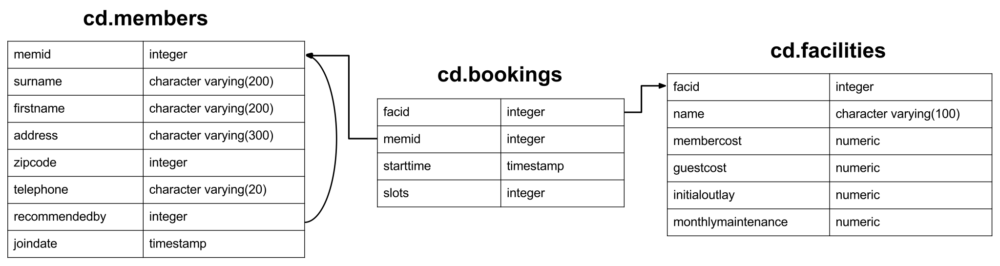

## Postgresql Excercise

These codes below are actually answers of the pracitice website https://pgexercises.com 


The exercises are divided into some increasingly difficult topic. Such as:

* Basic
* Joins and Subqueries
* Modifying data
* Aggregates
* Date
* String
* Recursive




### 1. Basic
 #### a) How can you retrieve all the information from the cd.facilities table?
 #### Ans :
 ```sql
SELECT *
FROM cd.facilities
```


#### b)You want to print out a list of all of the facilities and their cost to members. How would you retrieve a list of only facility names and costs?
 #### Ans :
 ```sql
 SELECT name,membercost
FROM cd.facilities;
````
#### c) How can you produce a list of facilities that charge a fee to members?
 #### Ans :
``` sql
SELECT *
FROM cd.facilities 
WHERE membercost !=0;
```


#### d) How can you produce a list of facilities that charge a fee to members, and that fee is less than 1/50th of the monthly maintenance cost? Return the facid, facility name, member cost, and monthly maintenance of the facilities in question.
 #### Ans :
 ```sql
 SELECT   facid, name, membercost, monthlymaintenance
FROM cd.facilities
WHERE membercost <(monthlymaintenance/50) and membercost>0;
```


 #### e) How can you produce a list of all facilities with the word 'Tennis' in their name?

 #### Ans :
```sql
SELECT *
FROM cd.facilities
WHERE name LIKE '%Tennis%';
```


 #### f) How can you retrieve the details of facilities with ID 1 and 5? Try to do it without using the OR operator.
 #### Ans :
 ```sql
 SELECT *
FROM cd.facilities
WHERE facid IN(1,5);
```

 #### g) How can you produce a list of facilities, with each labelled as 'cheap' or 'expensive' depending on if their monthly maintenance cost is more than $100? Return the name and monthly maintenance of the facilities in question.
 #### Ans :
 ```sql
 SELECT name,
CASE WHEN (monthlymaintenance>100) THEN
 	'expensive'
	 ELSE
	 'cheap'
	 END
	 AS cost
FROM cd.facilities;
```

 #### h) How can you produce a list of members who joined after the start of September 2012? Return the memid, surname, firstname, and joindate of the members in question.
 #### Ans :
 ```sql
 SELECT memid, surname, firstname, joindate 
FROM cd.members
WHERE joindate>='2012-09-01';
 ```


#### i) How can you produce an ordered list of the first 10 surnames in the members table? The list must not contain duplicates.
 #### Ans :
 ```sql
 SELECT DISTINCT(surname)
FROM cd.members ORDER BY surname
LIMIT 10;
 ```

#### j) You, for some reason, want a combined list of all surnames and all facility names. Yes, this is a contrived example :-). Produce that list!
 #### Ans :
 ```sql
 SELECT surname
FROM cd.members

UNION

SELECT name
FROM cd.facilities

 ```


####    k) You'd like to get the signup date of your last member. How can you retrieve this information?

 #### Ans :
 ```sql
SELECT MAX(joindate) AS latest
FROM cd.members;
```


####    l) You'd like to get the first and last name of the last member(s) who signed up - not just the date. How can you do that?

 #### Ans :
 ```sql
SELECT firstname, surname, joindate
FROM cd.members 
WHERE joindate = (
					SELECT MAX(joindate)
					FROM cd.members
				);
```